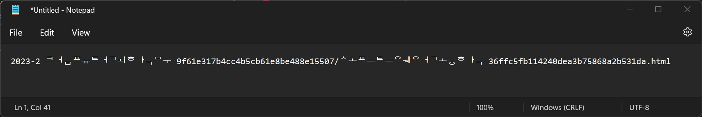
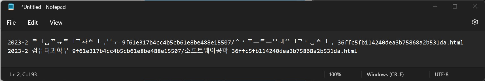

# Encoded NFD href(src) to encoded NFC

## 어떻게 사용하는가?

1. 스크립트를 실행하기 위한 패키지들을 설치합니다.

    ```bash
    npm install
    ```

1. 파일 하나에 대해서 작업을 수행할 수도 있고,

    ```bash
    node main.js -f {your-html-file-name}
    ```

    또는

    ```bash
    npm start -- -f {your-html-file-name}
    ```

1. 디렉터리에 대해서도 작업을 수행할 수 있습니다(어떤 파일을 수정할 지 물어봅니다).

    ```bash
    node main.js -d {your-directory-to-proceed}
    ```

    또는

    ```bash
    npm start -- -d {your-directory-to-proceed}
    ```

## 왜 만들었는가?

### 문제 상황

- Notion으로 작성한 페이지를 HTML로 내보내기 했을 때, 그 하위 페이지들이 제대로 연결되지 않았다!
- HTML을 까보니 육안상 아무런 문제가 없어 보였다.
- 신기하게도 맥에서는 연결이 잘 되는데, 윈도우에서는 안된다!
- 설마, 한글 자소 분리 문제 때문인가 싶어서 `href`에 있는 문자열을 decode 해보니 NFD(조합형 한글 표기법)로 저장이 돼있었다...😠

    ```html
    <a href="2023-2%20%E1%84%8F%E1%85%A5%E1%86%B7%E1%84%91%E1%85%B2%E1%84%90%E1%85%A5%E1%84%80%E1%85%AA%E1%84%92%E1%85%A1%E1%86%A8%E1%84%87%E1%85%AE%209f61e317b4cc4b5cb61e8be488e15507/%E1%84%89%E1%85%A9%E1%84%91%E1%85%B3%E1%84%90%E1%85%B3%E1%84%8B%E1%85%B0%E1%84%8B%E1%85%A5%E1%84%80%E1%85%A9%E1%86%BC%E1%84%92%E1%85%A1%E1%86%A8%2036ffc5fb114240dea3b75868a2b531da.html"><span class="icon">📕</span>소프트웨어공학</a>
    ```

    - 위의 `href`를 디코딩해보면 다음과 같다. 웹 브라우저에서는 NFD 형식의 문자열을 알아서 합쳐서 보여주는 것 같다. 윈도우에서는 완전 다르게 표시된다.

      

### 해결 방법

- 간단하다. 아래의 과정을 node로 자동화했다.

    1. 문제가 되는 HTML을 연다.
    2. `a` 태그의 `href`와 `img` 태그의 `src`의 값들을 찾는다.
    3. 해당 값들을 URI decode한다.
    4. 해당 값들을 NFC로 변환한다.
    5. 해당 값들을 URI encode한다.

### 결과

- 윈도우에서든 맥에서든 HTML 링크가 잘 연결된다! 물론, 파일 시스템 상에서도 경로가 NFC 형태로 있어야 한다(맥에서는 아니어도 가능해 보인다).

    ```html
    <a href="2023-2%20%EC%BB%B4%ED%93%A8%ED%84%B0%EA%B3%BC%ED%95%99%EB%B6%80%209f61e317b4cc4b5cb61e8be488e15507/%EC%86%8C%ED%94%84%ED%8A%B8%EC%9B%A8%EC%96%B4%EA%B3%B5%ED%95%99%2036ffc5fb114240dea3b75868a2b531da.html"><span class="icon">📕</span>소프트웨어공학</a>
    ```

    - 위의 `href`를 디코딩해보면 다음과 같다.

        

### 의문점

- 분명 윈도우 환경에서 Notion 내보내기를 했는데 이러한 문제가 발생했다. 파일 이름들은 다 NFC 형태로 저장됐는데(반디집으로 압축을 풀어서 알아서 해준 것일 지도), HTML 내부 파일 경로는 NFD 형태였다.
- 맥에서 Notion 페이지를 만들고 수정했으니 NFD 형태로 문자가 입력된 것일까? 그저 추측할 뿐이다.